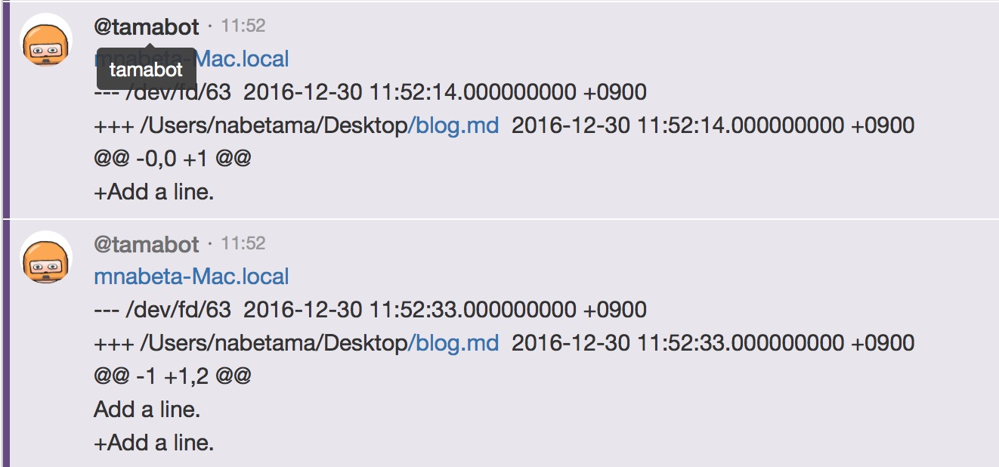

# dnotifier

[](https://godoc.org/github.com/satoshun/dnotifier) [](https://travis-ci.org/satoshun/dnotifier) [](https://codecov.io/gh/satoshun/dnotifier)


Send slack message when changed file.


## install

```shell
go get github.com/satoshun/dnotifier/cmd/dno
```


## usage

```shell
dno slack -u ${your slack webhook url} -f ${file path} -f ${file path} ...
```


## Examples

### In the case of slack.

```shell
~/g/s/g/s/dnotifier ❯❯❯ dnotifier slack -u https://hooks.slack.com/services/xxxxxxxxx/xxxxxxxx/xxxxxxxxxxxx -f main.go
Watching: main.go
/Users/satouhayabusa/go/src/github.com/satoshun/dnotifier/main.go
2016/06/15 10:43:00 main.go:55: post:--- /dev/fd/63 2016-06-15 10:43:00.000000000 +0000
+++ /Users/satouhayabusa/go/src/github.com/satoshun/dnotifier/main.go 2016-06-15 10:42:59.000000000 +0000
@@ -42,6 +42,8 @@
    HookURL: *slackHookURL,
  }

+ log.Println("test")
+
  for i, f := range files {
    files[i], _ = filepath.Abs(f)
    fmt.Println("Watching: " + f)
```


### In the case of HipChat.

```sh
~/dev/src/github.com/satoshun/dnotifier/cmd/dno (git)-[hipchat]-
> ./dno hipchat -hc-room <YOUR ROOM ID> -hc-token <YOUR ACCESS TOKEN> -f /Users/nabetama/Desktop/blog.md
Watching: /Users/nabetama/Desktop/blog.md ...
2016/12/30 11:52:14 changed: /Users/nabetama/Desktop/blog.md
2016/12/30 11:52:14 Send to hipchat.
2016/12/30 11:52:16 Done sending a diff log.
2016/12/30 11:52:33 changed: /Users/nabetama/Desktop/blog.md
2016/12/30 11:52:33 Send to hipchat.
2016/12/30 11:52:33 Done sending a diff log.
```



## todos

- IRC, etc
