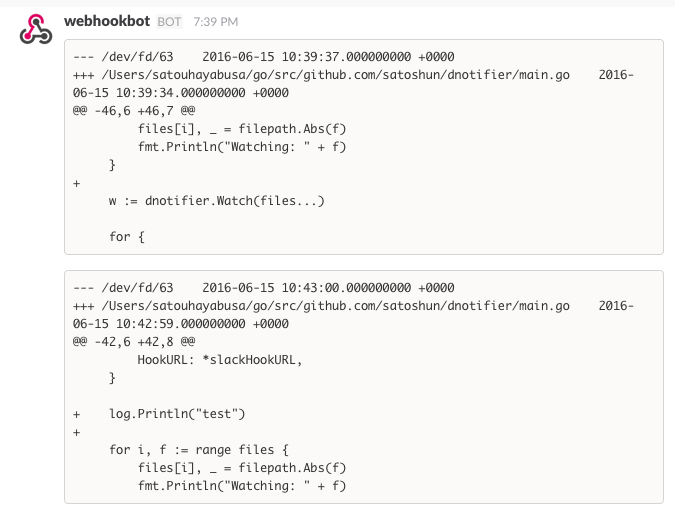

# dnotifier

Send slack message when changed file.

It runs on OSX or Linux. if your platform is OSX then must be install `fswatch`.

```shell
brew install fswatch
```


## install

```shell
go get github.com/satoshun/dnotifier
```


## usage

```shell
dnotifier -u ${your slack webhook url} -f ${file path} -f ${file path} ...
```


## example

```shell
~/g/s/g/s/dnotifier ❯❯❯ dnotifier -u https://hooks.slack.com/services/xxxxxxxxx/xxxxxxxx/xxxxxxxxxxxx -f main.go
Watching: main.go
/Users/satouhayabusa/go/src/github.com/satoshun/dnotifier/main.go
2016/06/15 10:43:00 main.go:55: post:--- /dev/fd/63 2016-06-15 10:43:00.000000000 +0000
+++ /Users/satouhayabusa/go/src/github.com/satoshun/dnotifier/main.go 2016-06-15 10:42:59.000000000 +0000
@@ -42,6 +42,8 @@
    HookURL: *slackHookURL,
  }

+ log.Println("test")
+
  for i, f := range files {
    files[i], _ = filepath.Abs(f)
    fmt.Println("Watching: " + f)
```


